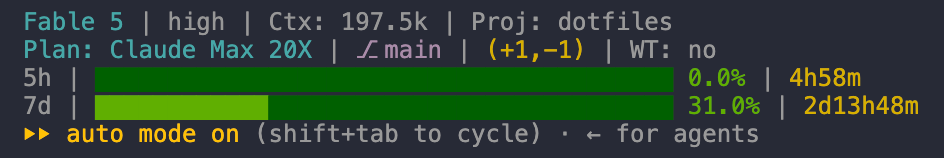
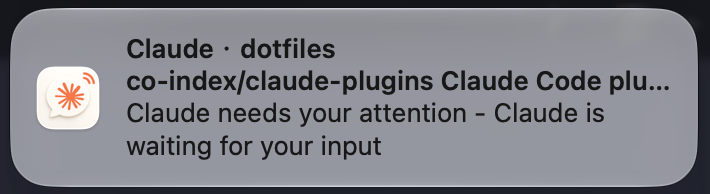
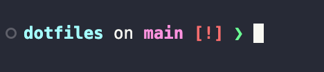

# dotfiles

[English](#english) | [中文](#中文)

Personal macOS development environment configuration, organized as
independently installable modules. Every installer backs up existing files
before overwriting them.

## English

### Modules

| Module | Contents | Installs to | Extra prerequisites |
|---|---|---|---|
| [claude](claude/README.md) | Claude Code macOS notifications, status line, `ccdots` version manager | `~/.claude`, `~/.config/ccstatusline`, `~/.local/bin` | Claude Code; Node.js + npm |
| [vscode](vscode/README.md) | VS Code settings, keybindings, extension list | `~/Library/Application Support/Code/User` | VS Code; `code` CLI for extensions |
| [starship](starship/README.md) | Starship prompt configuration | `~/.config/starship.toml` | starship |

### Preview

The Claude Code status line (claude module):



macOS notifications (claude module; clicking the banner jumps back to the
app running Claude Code, powered by the standalone
[ccnotify](https://github.com/co-index/ccnotify) project):



The Starship prompt (starship module):



### Prerequisites

Shared by all modules:

- macOS
- git
- `/usr/bin/python3` (ships with the Xcode Command Line Tools: `xcode-select --install`)
- curl (bundled with macOS)

Each module lists its extra prerequisites in the table above; read the
module README's Prerequisites section before installing.

### Quick Start

```bash
git clone https://github.com/co-index/dotfiles.git
cd dotfiles
./install.sh            # print usage and the module list; installs nothing
./install.sh claude     # install one module
./install.sh --all      # install everything
```

Installers back up any file they overwrite next to the original, named like
`settings.json.bak.20260610-153000`. Restart the affected applications
(Claude Code / VS Code / your terminal) after installing.

### Updating

```bash
git pull
./install.sh <module>
```

The claude module also ships `ccdots`, which checks, upgrades, and rolls
back by GitHub release — see [claude/README.md](claude/README.md).

### Uninstalling

```bash
./uninstall.sh <module>    # uninstall one module
./uninstall.sh --all       # uninstall everything
```

Every file is backed up as `.bak.YYYYMMDD-HHMMSS` before removal; the claude
module also strips the settings this project added from
`~/.claude/settings.json` while keeping your own settings. See each module
README for details.

### Exporting local changes back into the repo

The vscode and starship modules provide export scripts:

```bash
bash vscode/export.sh
bash starship/export.sh
```

Review the exported files for secrets (tokens, proxy addresses, private
hosts) before committing.

### Testing

```bash
bash scripts/test.sh
```

All tests run offline against temporary directories and never touch your
real configuration.


## 中文

### 模块

| 模块 | 内容 | 安装位置 | 额外前置条件 |
|---|---|---|---|
| [claude](claude/README.md) | Claude Code macOS 通知、状态栏、`ccdots` 版本管理 | `~/.claude`、`~/.config/ccstatusline`、`~/.local/bin` | Claude Code；Node.js + npm |
| [vscode](vscode/README.md) | VS Code settings、keybindings、插件清单 | `~/Library/Application Support/Code/User` | VS Code；装插件需 `code` CLI |
| [starship](starship/README.md) | Starship 终端提示符配置 | `~/.config/starship.toml` | starship |

### 效果预览

Claude Code 状态栏（claude 模块）：


macOS 通知（claude 模块，点击横幅跳回运行 Claude Code 的应用，由独立项目
[ccnotify](https://github.com/co-index/ccnotify) 提供）：


Starship 提示符（starship 模块）：


### 前置条件

所有模块共同要求：

- macOS
- git
- `/usr/bin/python3`（随 Xcode Command Line Tools 提供：`xcode-select --install`）
- curl（macOS 自带）

各模块的额外前置条件见上表，安装前请阅读对应模块 README 的"前置条件"一节。

### 快速开始

```bash
git clone https://github.com/co-index/dotfiles.git
cd dotfiles
./install.sh            # 查看用法和模块列表，不会安装任何东西
./install.sh claude     # 安装单个模块
./install.sh --all      # 安装全部模块
```

安装脚本覆盖已有文件前会生成同目录备份，格式如 `settings.json.bak.20260610-153000`。
安装完成后重启对应应用（Claude Code / VS Code / 终端）。

### 更新

```bash
git pull
./install.sh <module>
```

claude 模块还提供 `ccdots` 命令，按 GitHub Release 检查、升级和回滚版本，
详见 [claude/README.md](claude/README.md)。

### 卸载

```bash
./uninstall.sh <module>    # 卸载单个模块
./uninstall.sh --all       # 卸载全部模块
```

每个文件删除前都会生成 `.bak.YYYYMMDD-HHMMSS` 备份；claude 模块还会从
`~/.claude/settings.json` 中移除本项目写入的配置并保留你自己的设置。
各模块的卸载细节见对应 README。

### 把本机改动收回仓库

vscode 和 starship 模块提供导出脚本：

```bash
bash vscode/export.sh
bash starship/export.sh
```

导出后提交前，请检查文件中是否含有密钥、代理地址等私密内容。

### 测试

```bash
bash scripts/test.sh
```

全部测试离线运行，使用临时目录，不会改动你的真实配置。
